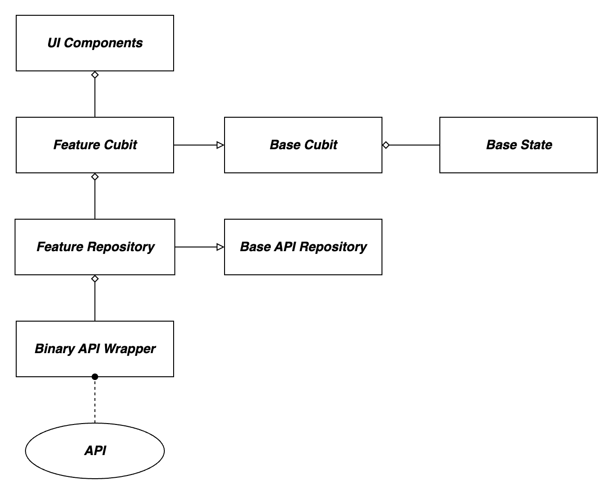
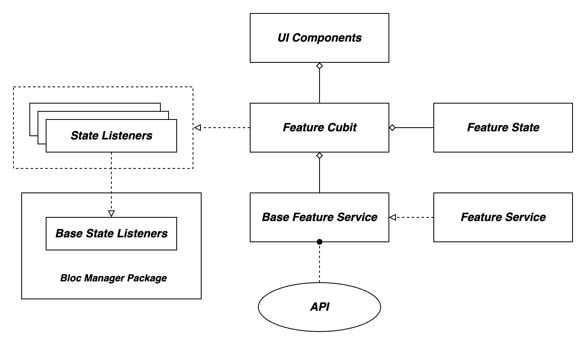
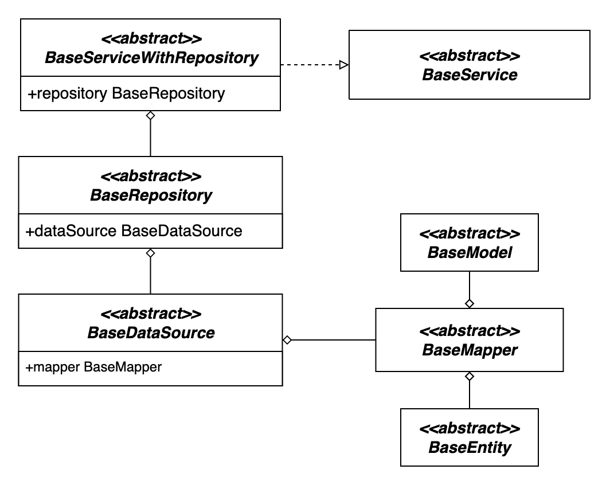
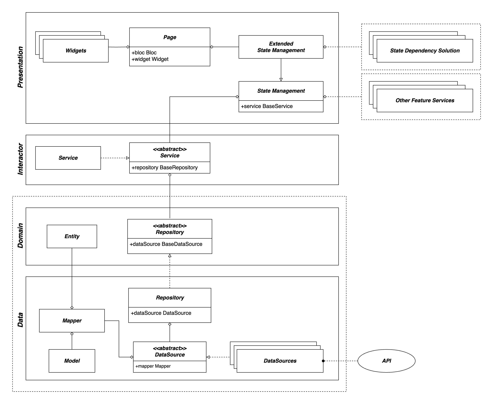
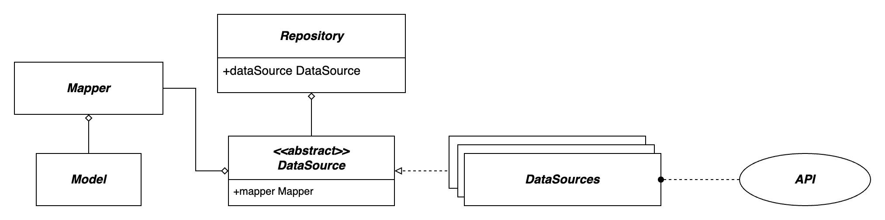
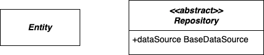
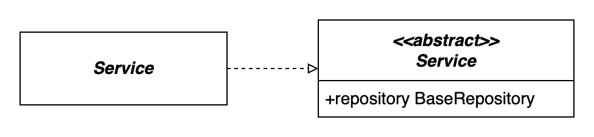
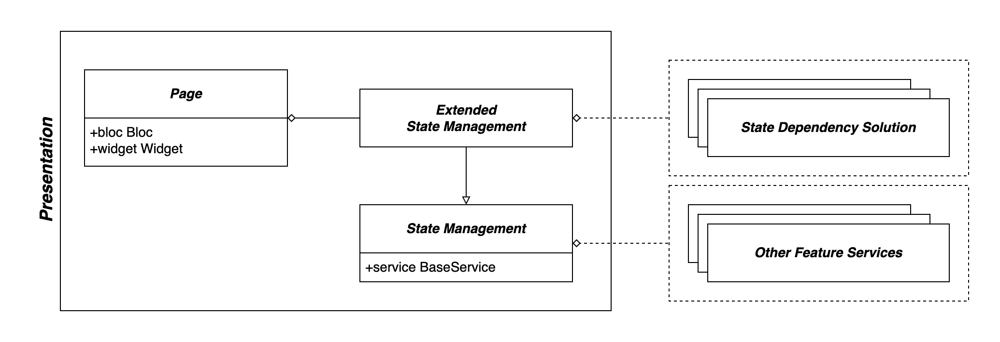
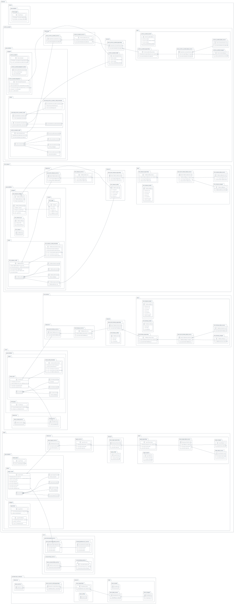

### Table of Contents

1. [What is Software Architecture?](#what-is-software-architecture)
2. [Difference Between Software Architecture and Design Patterns?](#difference-between-software-architecture-and-design-patterns)
   - [Software Architecture](#software-architecture)
   - [Design Patterns](#design-patterns)
3. [Key Goals of Effective Software Architecture](#key-goals-of-effective-software-architecture)
4. [Current Mobile Team Architectures](#current-mobile-team-architectures)
   - [Deriv P2P Architecture](#deriv-p2p-architecture)
     - [Architecture Components](#architecture-components)
     - [Challenges](#challenges)
   - [Deriv GO Architecture](#deriv-go-architecture)
     - [Architecture Components](#architecture-components-1)
     - [Challenges](#challenges-1)
5. [Proposed Architecture](#proposed-architecture)
   - [Architecture Components](#architecture-components-2)
     - [Core](#core)
     - [Feature](#feature)
       - [Data Layer](#data-layer)
       - [Domain Layer](#domain-layer)
       - [Interactor Layer](#interactor-layer)
       - [Presentation Layer](#presentation-layer)
       - [Cross Feature Communication](#cross-feature-communication)
   - [Example](#example)

# What is Software Architecture?

Software Architecture is the conceptual foundation and strategic framework for a software system. It encompasses the `fundamental design decisions` that shape the system's `structure`, `behavior`, and `interactions`. Like the architectural plan for a building, software architecture defines the `arrangement of components`, the `pathways of data`, and the mechanisms for achieving desired qualities such as `performance`, `scalability`, and `maintainability`. It serves as a blueprint that guides developers in creating a `cohesive`, `reliable`, and `adaptable` software solution that aligns with the project's objectives and user requirements.

## Difference Between Software Architecture and Design Patterns?

Software architecture and design patterns are both crucial concepts in software development, but they serve distinct purposes and operate at different levels of abstraction. Let's delve into the differences between these two concepts:

### Software Architecture

Software architecture refers to the `high-level structure` and `organization` of a software system. It outlines the `major components`, their `interactions`, `data flows`, and the `overall design decisions` that shape the system.

_**Scope:**_ Architecture provides the `fundamental framework` for the entire software application. It defines the system's major building blocks, their relationships, and the principles that guide their interactions.

_**Abstraction Level:**_ Architecture operates at a `higher level of abstraction` compare to design pattern, focusing on the `system as a whole`. It addresses questions like how components collaborate, how data moves, and how non-functional requirements are met.

_**Goals:**_ Architecture addresses key system-wide concerns such as `scalability`, `performance`, `security`, and `maintainability`. It sets the `strategic direction` and lays the groundwork for the entire project.

### Design Patterns

`Design patterns` are `reusable solutions` to `common software design problems`. They provide `templates` for solving specific design challenges and promoting `best practices`.

_**Scope:**_ Design patterns are `small-scale solutions` that target specific design problems within components or interactions. They help improve the design quality of individual parts of the system.

_**Abstraction Level:**_ Design patterns operate at a `lower level of abstraction` than architecture. They focus on `recurring design problems` and offer guidelines for structuring code within components.

_**Goals:**_ Design patterns contribute to `modular code`, `enhanced reusability`, and `improved code maintainability`. They aim to `simplify complex design decisions`, foster code consistency, and encourage `collaboration` among developers working on different parts of the system.

## Key Goals of Effective Software Architecture

Crafting a successful software architecture involves aiming for specific objectives that collectively contribute to the creation of a `reliable`, `adaptable`, and `user-centric system`. The following are the `core goals` that guide the development of effective software architecture:

_**Scalability:**_ The architecture should support handling `increased demands` by adding resources or components and maintaining performance and responsiveness.

_**Maintainability:**_ The architecture should make it easy to `identify`, `fix issues` or `enhancements`, minimizing the cost and effort of ongoing maintenance.

_**Modularity:**_ Components should be organized into `discrete`, `cohesive modules` that can be `developed`, `tested`, and `maintained` _independently_, promoting reusability and ease of updates.

_**Reusability:**_ Design decisions should facilitate the `reuse of components or patterns` across different parts of the system or in future projects.

_**Testability:**_ Designing the architecture to facilitate `comprehensive testing`, enabling efficient validation of the system's functionality, performance, and reliability.

# Current Mobile Team Architectures

## Deriv P2P Architecture

### Architecture Components

_**BinaryApiWrapper:**_ This component is responsible for `connecting` to the `Flutter Deriv API`. In fact We need this component to make Flutter Deriv API compatible with P2P app.

_**BaseAPIRepository:**_ This is a `base class` that provides `common methods` and functionalities for `repositories` that interact with APIs.

_**Features Repositories:**_ These repositories utilize the _BinaryApiWrapper_ to interact with the Deriv API and provide data to the feature cubits.

_**Feature Cubits:**_ `Cubits` are a part of the `Bloc pattern architecture`, commonly used with Flutter apps. They manage the `state` of the UI related to specific features. Each feature cubit extends the `BaseCubit` class, which includes states like `InitialState`, `LoadingState`, `LoadedState`, and `ErrorState`.

### Challenges

_**Dependency Injection and Component Replacement:**_ The architecture lacks proper `dependency injection`, making it challenging to `replace components` without affecting the entire system.
This can lead to difficulties in `swapping out components`, such as changing the _data source_ or replacing _UI elements_, potentially leading to `tight coupling` and `inflexibility`.

_**Testing Complexity:**_ The intricate `dependency flow` and the `tight coupling` between cubits, repositories, and UI elements can `complicate testing`.
Testing becomes more complex due to the `interwoven nature of components`, potentially resulting in less effective unit testing and a higher likelihood of integration issues.

_**Limited Base State and Flexibility:**_ The architecture's `Base State` is limited to a specific set of states, which might not cover all possible scenarios.
This limitation can restrict the `flexibility` to handle a wider range of UI states and can lead to less adaptable and more rigid user interfaces.

_**Lack of DataSource Layer:**_ The architecture doesn't seem to incorporate a dedicated `DataSource layer` for handling data retrieval and API communication.
This omission can result in difficulties when trying to change the way the application connects to APIs or external data sources, hindering the ability to adapt to changing requirements or technology advancements.

## Deriv GO Architecture

### Architecture Components

_**Flutter Deriv API (Data Source):**_ This component serves as the _Data Source_ for the application, providing access to the Flutter Deriv API. It _abstracts the API communication_ details and data retrieval logic.

_**Base Feature Service:**_ Each service has its own `Base Feature Service` that provides _common methods_ and _functionalities_ for that specific feature.

_**Feature Services:**_ These services are responsible for _interacting_ with the Flutter Deriv API. Each service corresponds to a _specific feature or domain_ within the app.

_**Feature Cubits:**_ `Cubits` are used to `manage the state of the UI` related to specific features. Each cubit is associated with a specific feature and contains the logic for managing UI states.

_**Bloc Manager:**_ This component employs the `Observer Pattern` to manage dependencies between different feature cubits. It emits states to dependent cubits based on state changes.

### Challenges

_**Direct Data Source Connection by Services:**_ Connecting to the `Data Source` (API) is managed directly by the services, potentially leading to `tight coupling` between the services and the API.
This can make the code less flexible and harder to adapt to changes in the API or data source. It might also lead to difficulties in swapping out the data source if needed.

_**Complexity of State Dependency Management by Bloc Manager:**_ The complexity of managing state dependencies using the `Bloc Manager` could lead to intricate relationships between different feature cubits.
This complexity might make the application harder to understand, debug, and maintain. It could also lead to challenges in writing effective unit tests for the interactions between cubits.

_**Unclear Component Responsibilities:**_ The architecture might not provide clear and well-defined responsibilities for each component, making it challenging to determine where specific logic should reside.
This lack of clarity can lead to confusion among developers, code that's difficult to maintain, and potential overlaps or gaps in functionality.

# Proposed Architecture

In the dynamic landscape of modern software development, a robust and adaptable architecture is critical to the success of any project. The proposed software architecture, inspired by the principles of `Clean Architecture`, is aligned with the unique demands of our projects. By seamlessly integrating the core tenets of Clean Architecture with carefully tailored adjustments, we aim to empower our development teams to create applications that are `testable`, `reusable`, `modular`, and `scalable` and enable developers to `collaborate` seamlessly.

At the heart of the proposed architecture lies a dedication to fundamental design principles that foster `maintainability`, `flexibility`, and `growth`. We aim to improve how our applications are developed and maintained. The architecture rests on five pivotal pillars that shape its core essence:

_**Composition over Inheritance**_

In a world where software systems are growing increasingly complex, the principle of `Composition over Inheritance` gains even greater significance. This approach advocates building functionalities by composing smaller, more manageable components rather than relying heavily on complex inheritance hierarchies. By embracing composition, our architecture promotes flexibility, maintainability, and easier adaptability to changing business needs.

_**Program to Interfaces**_

The principle of `Program to Interfaces` encourages the use of interfaces to define contracts for components. This approach promotes loose coupling and reduces dependencies, making it easier to swap out components without affecting the entire system. By following this principle, our architecture fosters flexibility and adaptability, enabling developers to make changes without causing ripple effects throughout the codebase.

_**Single Responsibility (SR)**_

The principle of `Single Responsibility` underscores the importance of assigning a singular purpose to each module or component. By adhering to this principle, our architecture fosters clarity in design, isolates potential points of failure, and facilitates ease of maintenance. Modules dedicated to a specific task reduce interdependencies, enhancing the overall stability of the system.

_**Separation of Concerns (SoC)**_

Clear boundaries between different aspects of the software are achieved through the principle of `Separation of Concerns`. By modularizing functionalities based on their distinct responsibilities, our architecture promotes comprehensibility, ease of debugging, and promotes a streamlined development process. This separation also simplifies the integration of new features or changes without causing ripple effects across the entire codebase.

_**Open-Closed Principle (OCP)**_

The `Open-Closed Principle` advocates that software entities should be open for extension but closed for modification. By adhering to this principle, our architecture ensures that new functionalities can be added without altering existing code, thereby reducing the risk of introducing unintended side effects. This promotes a smoother development workflow, reducing regression risks and enhancing code stability.

_**Dependency Inversion (DI)**_

The `Dependency Inversion` encourages the decoupling of high-level modules from low-level implementation details, promoting a more adaptable and interchangeable architecture. By reversing traditional dependency flows, our architecture mitigates the risks associated with tight coupling, making it easier to substitute components and manage changes without cascading impacts throughout the system.

## Architecture Components

### Core

Core part is primarily focused on defining contracts and interfaces that features _must_ implement. This is a form of _contract-driven design_, where you're establishing a set of rules and guidelines that each feature should follow. This approach can provide clear boundaries and consistency across application architecture.

_**Base Data Source**_

This class serves as a contract that defines the methods and structure that feature-specific data sources must implement. It sets the guidelines for how data should be accessed and manipulated.

_**Base Model**_

Base Model is more about setting a guideline for what properties each feature-specific model should have. It can also be used to define common properties that should exist in each feature-specific model.

_**Base Entity Class**_

Similarly, the base entity class can provide guidelines for common fields that should exist in each feature-specific entity.

_**Base Mapper**_

The base mapper class defines the contract for mapping data between different layers. Each feature would implement its own mapper that adheres to this common contract, ensuring a consistent approach to data transformation.

_**Base Repository**_

The base repository class establishes the contract for data manipulation methods that should be present in feature-specific repositories. This ensures consistency in how data is handled.

_**Base Service**_

The base service classes define the contract for services that features can use. Depending on whether a feature needs to interact with the data layer through the repository or not, the appropriate base service can be chosen.

For example, if a feature needs to interact with the data layer through the repository, then it can use the `BaseServiceWithRepository`. If a feature doesn't need to interact with the data layer through the repository, then it can use the `BaseService` class.

### Feature

The feature architecture follows a modular and structured approach, facilitating the development of individual components. By dividing each feature into distinct layers, including Data, Domain, Interactor, and Presentation, we establish clear boundaries and responsibilities.

The Data layer encompasses data models, mappers, repositories, and data sources, ensuring consistent data access and manipulation.

The Domain layer focuses on core business entities and feature-specific repository contracts.

The Interactor layer hosts feature services, housing business logic and communication with repositories.

Finally, the Presentation layer handles UI state management and interaction, enhancing user experience through effective widget composition.

### Data Layer

_**Feature Model:**_ This represents the data structure specific to the feature. It only contains the properties that are relevant to the feature.

_**Feature Mapper:**_ This is responsible for mapping data between the feature model and other layers of architecture.

_**Implementation of Base Feature Repository:**_ This is where you implement the methods defined by the base feature repository contract in the domain layer. It provides actual data manipulation functionality for the feature.

_**Feature DataSource Abstraction and Implementations:**_ The feature-specific data source classes provide the means to access data for the feature. The abstraction ensures a consistent contract for data access methods, and the implementations interact with actual data sources like APIs, databases, etc.

### Domain Layer

_**Entity:**_ The entities within the domain layer represent core business objects that the feature deals with. These might mirror the structure of data retrieved from the data source.

_**Feature Repository Interface:**_ This defines the contract for interacting with the feature's data. It specifies the methods that should be available for data manipulation and retrieval.

#### Interactor Layer

_**Base Feature Service:**_ This abstract class defines the structure and methods for feature-specific services. It might include business logic, data processing, and interaction with repositories.

_**Service Implementation:**_ Each feature implements its own service class that extends the base feature service. This is where you implement the specific logic and operations related to the feature.

#### Presentation Layer

_**State Management:**_ This is where you implement the state management solution for the feature.

_**Extended State Management:**_ This class extends the state management class and acts as a bridge for interactions between different feature state management instances. It helps maintain a centralized point for communication between different UI components within the feature and also keeps the State Management Solution class clean.

_**Page and Widgets:**_ This is where you implement the UI for the feature. It includes the page and widgets that make up the feature's UI.

### Cross Feature Communication

- **Using Services from Another Feature**

  If you have a service defined in one feature (`Feature A`) that you want to utilize in another feature (`Feature B`), you can achieve this by injecting the service into state management class of `Feature B`. This means that the state management class acts as a central hub for providing access to various services across different features.

- **Sharing State Updates**

  When you need to access or receive updates about the state of a feature from within a different feature, you should inject the necessary state into the extended state management class. This extended state management class would likely handle state updates for multiple features, allowing them to communicate with each other by sharing state information.
  States could be shared between features using the following approaches:

  - Using a simple `stream` of `states` or an `intermediate model`.
  - Using a design pattern like `Observer Pattern` or `Mediator Pattern`.
  - Any other approach that makes sense for the specific use case.

## Example

Example of how to use this architecture can be found in the [example](example) folder.

