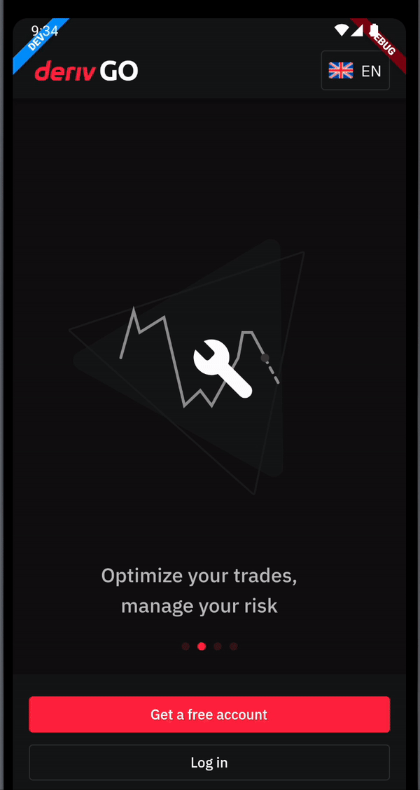

# Deriv Language Selector

A package to handle language changes in the app. 

## Features
- Bottomsheet widget with a list of languages to select from.
- A language selector button that opens a bottomsheet to select a language.
- Handles saving and retrieving the selected language from shared preferences.
- Handles state of the language of the app using Cubits.
- Provides interfaces to be implemented by the app to handle the language changes.
- Default flags and supported languages are: 
`en, es, fr, id, it, pl, pt, ru, th, vi, zh, ar, de, ko, sw, tr`
Client apps have the flexibility to use their own flag asset and supported languages.

## Usage
To use this package, add `deriv_language_selector` as a dependency in your pubspec.yaml file.

```yaml
dependencies:
  deriv_language_selector:
    git:
      url: https://github.com/deriv-com/flutter-deriv-packages.git
      path: packages/deriv_language_selector
      ref: deriv_language_selector-v0.0.1
```

In your dart file, import the package.

```dart
import 'package:deriv_language_selector/deriv_language_selector.dart';
```

## Getting Started
### Implement `BaseLanguageRepository`.

```dart
class LanguageRepository implements BaseLanguageRepository {


  @override
  FutureOr<List<String>?> getSupportedLanguagesFromServer({
    required ValueSetter<List<String>> onLanguageFetched,
  }) async {
    
    // If the server sends as a Future. (Ref from Deriv P2P app)
    await FirebaseRemoteConfig.instance.fetchAndActivate();
    final RemoteConfigValue remoteConfigValue = FirebaseRemoteConfig.instance
        .getValue(FirebaseRemoteConfigKeys.localLanguages);
    final String languagesData = remoteConfigValue.asString();


    if (languagesData.isNotEmpty) {
      final List<Map<String, dynamic>> listOfMaps =
          List<Map<String, dynamic>>.from(jsonDecode(languagesData));
      return listOfMaps
          .where((Map<String, dynamic> element) => element['active'] == true)
          .map((Map<String, dynamic> e) => e['countryCode'].toString())
          .toList();
    } else{
      return <String>[];
    }

    // If the server sends as stream (Ref from Deriv GO app)
    final WebsiteStatusCubit websiteStatusCubitInstance =
        BlocManager.instance.fetch<WebsiteStatusCubit>();

    websiteStatusCubitInstance.stream
        .startWith(websiteStatusCubitInstance.state)
        .listen(
      (WebsiteStatusState state) {
        if (state.websiteStatus != null) {
          // this will update the active languages in [LanguageService]
          // which is used by [LanguageCubit].
          onLanguageFetched.call(state.websiteStatus!.supportedLanguages!);

          BlocManager.instance.fetch<LanguageCubit>().updateActiveLanguages();
        }
      },
    );

    return null;
  }

  @override
  Future<void> loadLanguage(Locale locale) async {
    await Localization.delegate.load(locale);
  }

  @override
  void reconnectToServerWithNewLanguage(Locale locale) {
    // provide your implementation to reconnect to websocket with new language.
  }
}
```

### Provide `LanguageCubit` to the root widget.


```dart
final LanguageService languageService = LanguageService(
    languageRepository: LanguageRepository(),
    languageDataSource: LanguageDataSource(
      prefInstance: PrefService.instance!, //instance of shared preferences
      localStorageKey: 'language', // optional, default is 'appLanguage'
    ),
    supportedLanguages: supportedLanguages, // List of supported `LanguageEntity`
  );

BlocProvider(
  create: (context) => LanguageCubit(
    languageService: languageService,
  ),
  child: Widget(),
);
```


### Use `LanguageSelector.button` to display the language selector button.

The following parameters are available:

 * <b>showLanguageBottomSheet(optional)</b> - Function to show the language bottom sheet. The
   bottom sheet widget is provided through this function. This is added to give client
   apps flexibility to use their own handler for bottom sheet. Example, P2P uses
   Overlay.showDialog while GO uses showModalBottomSheet.
* <b>bottomsheetTitle</b> - Title of the bottom sheet for the case when going for default bottom sheet.
* <b>usePackageFlags (optional)</b> - Determines if the package flag assets should be used. `IF set to false,
   the client apps need to have assets added under the [assets/icons/flags] folder. The naming
   convention should be [ic_flag_language_code].png. example, ic_flag_en.png.`

```dart

LanguageSelector.button(
              bottomsheetTitle: context.localization.labelLanguage,
              showLanguageBottomSheet: // callback for showing bottomsheet (optional). Default uses `showModalBottomSheet`.
              usePackageFlags: false, // optional, default is true
            ),
```

When the button is clicked, it will open a bottomsheet with a list of languages to select from.


### Use `LanguageSelector.bottomSheet` to display the language selector bottom sheet.

The following parameters are available:

 * <b>usePackageFlags (optional)</b> - Determines if the package flag assets should be used. `IF set to false,
   the client apps need to have assets added under the [assets/icons/flags] folder. The naming
   convention should be [ic_flag_language_code].png. example, ic_flag_en.png.`

```dart
showModalBottomSheet(
  context: context,
  builder: (context) {
    return LanguageSelector.bottomSheet(
      usePackageFlags: false, // optional, default is true
    );
  },
);
```

A helper function `showExpandableLanguageBottomSheet` is provided to show the bottom sheet in `ExpandableBottomSheet`.

```dart

showExpandableLanguageBottomSheet(
  context: context,
  bottomsheetTitle: context.localization.labelLanguage,
  usePackageFlags: false, // optional, default is true
);
```


